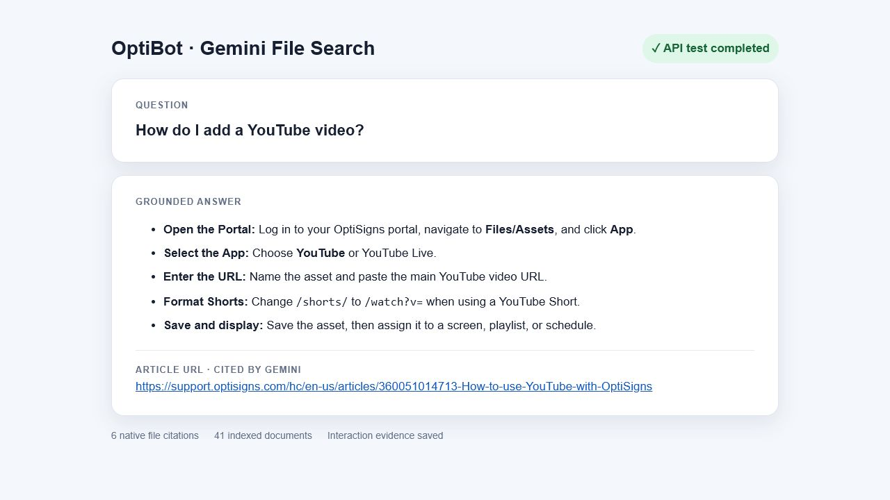

# Lumen Drift 731

A daily Gemini File Search knowledge sync for OptiSigns support content. It fetches 40+ Zendesk articles, removes page chrome, preserves Markdown headings, code, images, and links, then compares SHA-256 hashes stored as Gemini document metadata. Only new or changed documents are embedded; unchanged documents are skipped.

## Setup

```bash
cp .env.sample .env.local
pip install -r requirements.txt
```

Set `API_KEY` to a Gemini API key. For GitHub Actions, create the repository secret `GEMINI_API_KEY`.

## Run

```bash
python main.py
python -m pytest -q
```

```bash
docker build -t lumen-drift-731 .
docker run --rm -e API_KEY=your_key lumen-drift-731
```

Each invocation runs once and exits. The last run is written to `artifacts/last-run.json` with `added`, `updated`, and `skipped` counts. Gemini File Search uses 512-token chunks with 128-token overlap, its supported 25% overlap configuration.

## Daily job

GitHub Actions runs every day at 02:17 UTC and supports manual runs. [View job runs and downloadable last-run artifacts](https://github.com/mikeblocky/lumen-drift-731/actions/workflows/daily-sync.yml).

## Assistant proof


